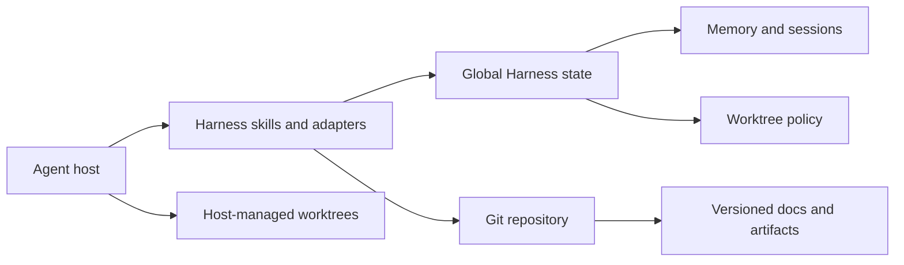

# Architecture

Harness separates the host runtime, global state, and versioned project documentation.

## Global state

`HARNESS_HOME` selects the storage root and defaults to `~/.harness`. Each project receives an opaque UUID and a dedicated container. Git repositories store the UUID only in local Git configuration, so initialization does not change `git status`.

Markdown contains readable knowledge. JSON and JSONL contain deterministic identity, registry, and generated catalog data. Generated indexes can be rebuilt from readable sources.

`managed.json` versions Harness-owned defaults. Updates refresh the managed charter, standards, aliases, and policies without overwriting machine-local override files.

## Automation

Harness installs lifecycle adapters by default. The core remains usable through explicit skills when a host cannot run hooks.

- `SessionStart` resolves identity and injects a budgeted context packet.
- `UserPromptSubmit` injects task-specific memory and handoffs without reloading all project state.
- Injected continuity rules direct the agent to maintain concise handoffs automatically for material work.
- `PreCompact` and `Stop` flush timestamps and explicitly structured state without fabricating summaries from raw chat.
- A `SessionStart` event with compact source reloads essential context.

Adapters fail open. They do not persist raw host messages, change product files, promote candidate memory automatically, or block the host when Harness is unavailable. Non-Git tasks skip Harness silently.

## Worktrees

Harness defines portable branch, base, isolation, and verification semantics. The active host creates worktrees through its native mechanism and owns checkout paths, storage layout, metadata, lifecycle, and cleanup. Codex therefore uses Codex worktree behavior, while another host uses its own compatible behavior.

Task branches use `type/slug`. Harness derives and validates the repository base revision, then verifies that implementation and tests run in the isolated checkout. When no host mechanism exists, the agent may use ordinary Git without imposing a Harness storage root. Host and user names never appear in Harness task branches.

## Delivery

Each skill is self-contained because `skills.sh` can install skills selectively. The repository also includes Codex and Claude plugin metadata for hosts that support full plugin bundles and lifecycle hooks.
