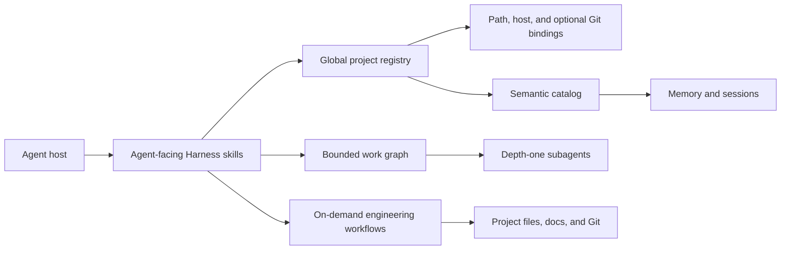

# Architecture

Harness separates host execution, machine-local project continuity, and optional project artifacts.

## Global state

`HARNESS_HOME` selects the storage root and defaults to `~/.harness`. Each project receives an opaque UUID and a dedicated container. Machine-local bindings resolve that UUID from an explicit ID, host project identity, the nearest registered path ancestor, or a legacy Git link. Git is optional.

Harness adds no identity marker or state directory to the project. A project may be a Git repository, a plain local folder, or a host-managed workspace.

Markdown contains readable knowledge. JSON and JSONL contain deterministic identity, registry, semantic cards, and generated catalog data. Generated indexes can be rebuilt from readable sources.

`managed.json` versions Harness-owned defaults. Updates refresh the managed charter, standards, aliases, and policies without overwriting machine-local override files.

## Pull-based recall

Recall separates discovery from content loading:

1. Search returns up to a small number of cards without full record content.
2. The agent hydrates only selected IDs under an explicit budget.

Ranking is deterministic and lexical. Titles, read rules, tags, exact phrases, status, and recency influence selection. No-match searches return nothing, and closed records rank below current active context.

Lifecycle adapters are opt-in, fail open, and remain model-silent. They are installed only through an explicit adapter action. They may maintain timestamps or clean temporary files, but they do not inject memory, initialize an unrelated directory, create an empty session, persist raw messages, or promote durable memory.

## Orchestration

Authorized multi-agent work is a bounded directed acyclic graph. The root agent is the only spawn authority and coordinates without performing substantive node work. Children have depth zero, minimal context packets, explicit dependencies, and disjoint output ownership.

Planner, worker, reviewer, fixer, and verifier are behaviors rather than permanent agent types. Reviews and verification are read-only; a fixer becomes the sole writer for an accepted repair. The graph enforces limits for nodes, waves, retries, review cycles, context, output, and reasoning effort, then stops as soon as the final evidence is sufficient.

## Optional engineering workflows

Harness defines and controls portable branch, base, creation, isolation, validation, adoption, reuse, and retirement semantics. The active host owns physical checkout paths, storage layout, and the native bookkeeping required to integrate those paths. Codex therefore uses Codex storage behavior, while Claude Code uses Claude Code storage behavior.

Task branches use `type/slug`. Harness derives and validates the repository base revision, orchestrates creation at the host-selected path, verifies that implementation and tests run in the isolated checkout, and governs safe retirement. Host-native create and remove operations are preferred when they preserve the Harness plan and update native bookkeeping. Otherwise, the agent may use ordinary Git at the host-selected path. Harness never imposes a storage root, and host or user names never appear in Harness task branches.

Worktrees, commits, pull requests, reviews, developer documentation, and HTML artifacts remain self-contained skills. They activate only for relevant project work and do not shape non-engineering continuity.

## Delivery

Each skill is self-contained because `skills.sh` can install skills selectively. The repository also includes Codex and Claude plugin metadata; lifecycle adapters remain a separate opt-in action.
